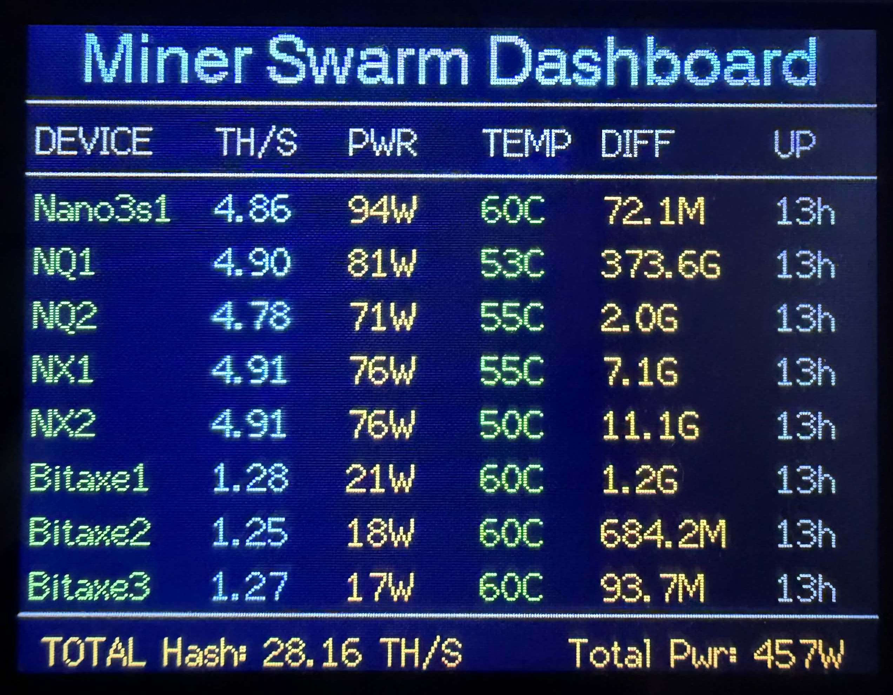

# ⛏️ Miner Swarm Dashboard (ESP32 CYD)

  

> **🚀 FREE COMMUNITY FIRMWARE** > Stop checking your phone. Start monitoring your swarm. This dedicated desk-side monitor tracks up to 8 miners in real-time.
>
> ## ❤️ Support the Developer
This firmware is provided free of charge. If this is useful, consider supporting future updates and projects no amount too small!

- [☕ Buy Me a Coffee](https://buymeacoffee.com/stuartbinnz)
- [💸 PayPal Donation](https://www.paypal.com/paypalme/stub1958)
### 📦 [🛒 BUY A PRE-BUILT UNIT ON EBAY (UK ONLY)](https://www.ebay.co.uk/itm/206164159288)
*Hand-assembled, 3D printed case, and pre-flashed by the developer.*

### 👉 [⚡ CLICK HERE TO INSTALL VIA WEB BROWSER](https://stu1958.github.io/miner-swarm-dashboard/)

---

## ✨ Why Choose Miner Swarm Dashboard?
- **Instant Fleet View:** See instantly that all your miners are hashing correctly without needing a phone or PC.
- **Always-On Monitoring:** Lives on your desk as a standalone monitor—no browser logins or dashboards to open.
- **Multi-Room Support:** Flash multiple displays to keep a monitor in your office, workshop, or kitchen.
- **Avalon Optimized:** Specifically designed to save "Best Difficulty" stats for Avalon Nano 3/3S—a feature not found in standard monitors.

## 📏 App Setup Naming
**IMPORTANT:** When entering your miner names during setup, follow these rules to ensure the correct hardware logic is applied (8 characters max).

| Target Hardware | App Name Requirement | Example |
| :--- | :--- | :--- |
| **Avalon Nano 3S** | Name must contain `NANO` and `3S` | `N3S_RIG` |
| **Avalon Nano 3** | Name must contain `NANO` and `3` | `N3_MAIN` |
| **N-Series (NX/NQ)** | Name must START with `NX` or `NQ` | `NX6_01` |
| **Standard Bitaxe** | Any other standard name | `Baxe_01` |

---

- ### 🔗 Related Projects
* **[Avalon Nano Ultra Controller](https://github.com/Stu1958/Avalon-Nano-Ultra-Controller)** – The ultimate thermal watchdog and companion for your Avalon Nano 3/3S.

## ⚖️ Legal & Usage Policy
**© 2026 Stu1958. All Rights Reserved.**

This firmware is for **personal, non-commercial use only**. You may NOT pre-flash hardware with this software for resale on platforms like eBay or Etsy. Commercial licensing is required for hardware vendors.

---
*Created by Stu1958. Not affiliated with Avalon or Bitaxe.*
